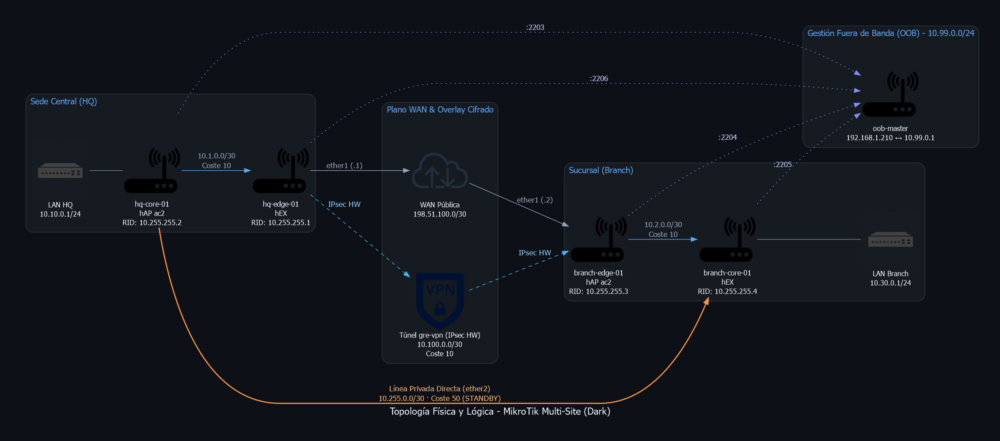
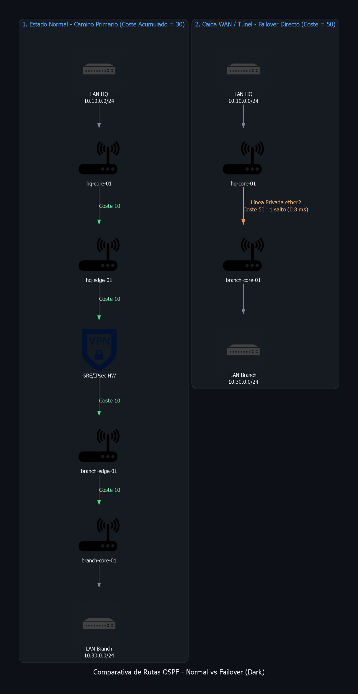
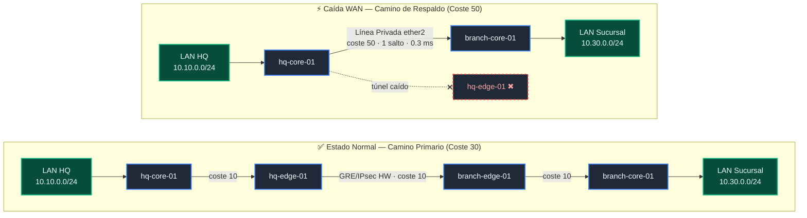

```mermaid
graph LR
    classDef router fill:#1f2937,stroke:#3b82f6,stroke-width:2px,color:#f9fafb
    classDef lan    fill:#064e3b,stroke:#10b981,stroke-width:2px,color:#ecfdf5
    classDef cloud  fill:#0f172a,stroke:#64748b,stroke-width:2px,color:#f8fafc
    classDef oob    fill:#312e81,stroke:#818cf8,stroke-width:1px,color:#e0e7ff

    subgraph HQ ["🏢 Sede Central"]
        direction TB
        LAN_HQ["LAN · 10.10.0.0/24"]:::lan
        HQ_CORE["hq-core-01\nhAP ac2 · RID 10.255.255.2"]:::router
        HQ_EDGE["hq-edge-01\nhEX · RID 10.255.255.1"]:::router
        LAN_HQ --- HQ_CORE
        HQ_CORE -->|"10.1.0.0/30 · coste 10"| HQ_EDGE
    end

    subgraph INTERNET ["☁️ WAN · 198.51.100.0/30"]
        CLOUD(["Internet"]):::cloud
    end

    subgraph BRANCH ["🏪 Sucursal"]
        direction TB
        BR_EDGE["branch-edge-01\nhAP ac2 · RID 10.255.255.3"]:::router
        BR_CORE["branch-core-01\nhEX · RID 10.255.255.4"]:::router
        LAN_BR["LAN · 10.30.0.0/24"]:::lan
        BR_EDGE -->|"10.2.0.0/30 · coste 10"| BR_CORE
        BR_CORE --- LAN_BR
    end

    %% Camino primario — enlace WAN físico
    HQ_EDGE -->|"ether1 · .1"| CLOUD
    CLOUD -->|"ether1 · .2"| BR_EDGE

    %% Camino primario — túnel GRE/IPsec sobre WAN
    HQ_EDGE -.->|"gre-vpn · IPsec HW\n10.100.0.0/30 · coste 10"| BR_EDGE

    %% Camino de respaldo — línea privada directa
    HQ_CORE ==>|"ether2 ↔ ether2 · 10.255.0.0/30\ncoste 50 · STANDBY"| BR_CORE

    %% Plano de gestión OOB
    subgraph OOB ["🔧 Gestión Fuera de Banda · 10.99.0.0/24"]
        BASTION["oob-master\n192.168.1.210 ↔ 10.99.0.1"]:::oob
    end

    HQ_EDGE -.-|"ether5 · :2206"| BASTION
    HQ_CORE -.-|"ether5 · :2203"| BASTION
    BR_EDGE -.-|"ether5 · :2204"| BASTION
    BR_CORE -.-|"ether5 · :2205"| BASTION
```

# Multi-Site MikroTik Lab: Redundant GRE/IPsec, OSPFv2 & Automated Telemetry

Laboratorio de infraestructura de red multisitio de alta disponibilidad sobre hardware físico MikroTik (hEX y hAP ac2). Implementa una arquitectura distribuida con sede central (HQ) y sucursal (Branch), redundancia dinámica enrutada mediante OSPFv2, túneles cifrados GRE over IPsec con aceleración por hardware (SoC crypto engine), automatización declarativa con Ansible (playbooks organizados y colección modular) y telemetría de paquetes en tiempo real mediante streaming TZSP hacia Wireshark con análisis de cifrado ESP.

---

## 1. Topología del Laboratorio

### 1.1 Topología Física y Lógica

<picture>
  <source media="(prefers-color-scheme: dark)" srcset="docs/img/topologia_red_dark.png">
  <source media="(prefers-color-scheme: light)" srcset="docs/img/topologia_red_light.png">
  
</picture>

<details>
<summary>Ver diagrama Mermaid interactivo</summary>



</details>

---

## 2. Plan de Direccionamiento e Inventario

| Nodo | Rol | Modelo | Interfaz | Dirección IP | Función / Tráfico |
| --- | --- | --- | --- | --- | --- |
| **hq-edge-01** | WAN Gateway HQ | hEX | `ether1`<br>`ether2`<br>`gre-vpn`<br>`ether5` | `198.51.100.1/30`<br>`10.1.0.1/30`<br>`10.100.0.1/30`<br>`10.99.0.6/24` | WAN Pública Directa<br>Tránsito hacia HQ Core<br>Punto a Punto Túnel GRE/IPsec<br>Gestión OOB (Port Forward 2206) |
| **hq-core-01** | Distribución / LAN | hAP ac2 | `ether1`<br>`ether2`<br>`br-lan`<br>`ether5` | `10.1.0.2/30`<br>`10.255.0.1/30`<br>`10.10.0.1/24`<br>`10.99.0.3/24` | Tránsito hacia HQ Edge<br>Línea Privada Respaldo (Core-to-Core)<br>Gateway Usuarios HQ (OSPF Pasivo)<br>Gestión OOB (Port Forward 2203) |
| **branch-edge-01** | WAN Gateway Branch | hAP ac2 | `ether1`<br>`ether2`<br>`gre-vpn`<br>`ether5` | `198.51.100.2/30`<br>`10.2.0.1/30`<br>`10.100.0.2/30`<br>`10.99.0.4/24` | WAN Pública Directa<br>Tránsito hacia Branch Core<br>Punto a Punto Túnel GRE/IPsec<br>Gestión OOB (Port Forward 2204) |
| **branch-core-01** | Distribución / LAN | hEX | `ether1`<br>`ether2`<br>`br-lan`<br>`ether5` | `10.2.0.2/30`<br>`10.255.0.2/30`<br>`10.30.0.1/24`<br>`10.99.0.5/24` | Tránsito hacia Branch Edge<br>Línea Privada Respaldo (Core-to-Core)<br>Gateway Usuarios Branch (OSPF Pasivo)<br>Gestión OOB (Port Forward 2205) |
| **oob-master** | Bastión OOB / NAT | RouterOS | `ether1`<br>`ether2-5` | `192.168.1.210/24`<br>`10.99.0.1/24` | Uplink hacia LAN local y Ansible<br>Plano aislado de gestión y NAT TZSP |

---

## 3. Ingeniería de Enrutamiento y Redundancia (OSPFv2)

El plano de control corre OSPFv2 monoproceso en el área backbone `0.0.0.0` con optimizaciones para topologías punto a punto y selección determinista de rutas:

* **Supresión de DR/BDR (`network-type=point-to-point`):** Todas las interfaces de tránsito y el túnel operan sin elecciones Designated Router, reduciendo el overhead de paquetes Hello/LSU y minimizando el tiempo de convergencia ante cambios de estado.
* **Aislamiento de interfaces de usuario (`passive=yes`):** Los bridges `br-lan` anuncian las redes de clientes (`10.10.0.0/24` y `10.30.0.0/24`) como rutas stub internas, bloqueando la emisión de paquetes Hello hacia el exterior.

### 3.1 Métricas de Ruta y Lógica de Failover

<picture>
  <source media="(prefers-color-scheme: dark)" srcset="docs/img/failover_ospf_dark.png">
  <source media="(prefers-color-scheme: light)" srcset="docs/img/failover_ospf_light.png">
  
</picture>

<details>
<summary>Ver diagrama Mermaid interactivo</summary>



</details>

$$\text{Coste Primario (VPN)} = 10\ (\text{Tránsito HQ}) + 10\ (\text{Túnel GRE}) + 10\ (\text{Tránsito Branch}) = \mathbf{30}$$

$$\text{Coste Respaldo (Línea Privada Directa)} = \mathbf{50}$$

---

## 4. Estructura del Repositorio

El laboratorio está organizado en dos niveles de automatización: **Playbooks directos clasificados por función** y una **Colección modular de Ansible basada en roles**.

```text
.
├── collection/                          # Colección Ansible estándar (rsessa.routeros_ops)
│   ├── galaxy.yml                       # Manifiesto oficial de la colección
│   ├── README.md                        # Documentación técnica de roles y playbooks modulares
│   ├── playbooks/                       # Orquestadores modulares por rol
│   │   ├── deploy_site.yaml             # Despliegue integral de routers
│   │   ├── setup_bastion.yaml           # Provisión de Bastión y Firewall/NAT
│   │   ├── backup.yaml                  # Extracción centralizada de backups
│   │   ├── restore.yaml                 # Restauración de snapshots
│   │   ├── upgrade.yaml                 # Actualización de ROS y bootloader
│   │   └── audit.yaml                   # Auditoría de recursos y estado L2/L3
│   └── roles/                           # Roles modulares desacoplados (9 roles)
│       ├── mikrotik_common/             # Identidad, servicios de gestión y claves SSH
│       ├── mikrotik_interfaces/         # Bridges, puertos y estado físico de interfaces
│       ├── mikrotik_ip/                 # Direccionamiento IP y enrutamiento estático
│       ├── mikrotik_gre_ipsec/          # Túneles GRE con cifrado IPsec acelerado
│       ├── mikrotik_ospf/               # Instancias, Router-ID, áreas y redes OSPFv2
│       ├── mikrotik_firewall/           # Firewall Filter y NAT no destructivos por comentario
│       ├── mikrotik_backup/             # Respaldo .rsc y binario .backup con limpieza
│       ├── mikrotik_restore/            # Rollback y verificación de arranque
│       └── mikrotik_upgrade/            # Actualización idempotente y alineación de bootloader
│
├── playbooks/                           # Flujos de trabajo del laboratorio clasificados
│   ├── 01_provisioning/                 # Provisión inicial y topología de red
│   │   ├── deploy_ssh_keys.yaml         # Inyección de claves públicas SSH en los routers
│   │   ├── setup_bastion_oob.yaml       # Hardening, DNAT y aislamiento de oob-master
│   │   └── deploy_topology.yaml         # Despliegue de L2, L3, túneles GRE/IPsec y OSPF
│   ├── 02_operations/                   # Mantenimiento y operaciones del día 2
│   │   ├── backup_nodes.yaml            # Extracción de backups (.rsc y .backup)
│   │   ├── restore_nodes.yaml           # Restauración desatendida con :execute y polling
│   │   ├── upgrade_nodes.yaml           # Actualización secuencial de RouterOS y firmware
│   │   └── discover_topology.yaml       # Auditoría profunda y extracción de configuración
│   └── 03_telemetry_security/           # Telemetría, streaming TZSP e investigación IPsec
│       ├── start_tzsp_streaming.yaml    # Inicia captura de tráfico y streaming TZSP
│       ├── stop_tzsp_streaming.yaml     # Detiene captura y sniffer en el laboratorio
│       ├── enable_esp_null.yaml         # Conmuta propuesta IPsec a cifrado NULL (inspección)
│       └── revert_esp_secure.yaml       # Restaura cifrado fuerte AES-256-CBC con SHA-256
│
├── docs/                                # Diagramas interactivos y recursos gráficos
├── generate_diagrams.py                 # Script generador de diagramas de red
├── discover-inventory.sh                # Descubrimiento de vecinos MNDP y generación de inventario
└── README.md                            # Guía técnica principal del proyecto
```

---

## 5. Guía de Ejecución de Playbooks

Todos los comandos se ejecutan desde la raíz del proyecto sobre el controlador Ansible (WSL / Ubuntu):

### 5.1 Aprovisionamiento Inicial (`playbooks/01_provisioning/`)

```bash
# 1. Desplegar claves SSH en todos los nodos
ansible-playbook -i hosts.yaml playbooks/01_provisioning/deploy_ssh_keys.yaml

# 2. Configurar y proteger el Bastión OOB (oob-master)
ansible-playbook -i hosts.yaml playbooks/01_provisioning/setup_bastion_oob.yaml

# 3. Desplegar la topología completa de red (L2, L3, GRE/IPsec y OSPF)
ansible-playbook -i hosts.yaml playbooks/01_provisioning/deploy_topology.yaml
```

### 5.2 Operaciones y Mantenimiento (`playbooks/02_operations/`)

```bash
# Extracción de copias de seguridad (.rsc y .backup)
ansible-playbook -i hosts.yaml playbooks/02_operations/backup_nodes.yaml

# Restauración desatendida del último snapshot disponible
ansible-playbook -i hosts.yaml playbooks/02_operations/restore_nodes.yaml

# Actualización secuencial de RouterOS y bootloader RouterBOARD
ansible-playbook -i hosts.yaml playbooks/02_operations/upgrade_nodes.yaml -e "target_version=7.18"

# Auditoría y telemetría completa de configuración
ansible-playbook -i hosts.yaml playbooks/02_operations/discover_topology.yaml
```

### 5.3 Telemetría y Análisis de Seguridad (`playbooks/03_telemetry_security/`)

```bash
# Iniciar streaming TZSP de tráfico hacia Wireshark
ansible-playbook -i hosts.yaml playbooks/03_telemetry_security/start_tzsp_streaming.yaml -e "control_pc_ip=192.168.1.30"

# Habilitar cifrado ESP NULL para inspeccionar paquetes internos OSPF/GRE en Wireshark
ansible-playbook -i hosts.yaml playbooks/03_telemetry_security/enable_esp_null.yaml

# Revertir propuesta IPsec a cifrado seguro (AES-256-CBC)
ansible-playbook -i hosts.yaml playbooks/03_telemetry_security/revert_esp_secure.yaml

# Detener el streaming TZSP
ansible-playbook -i hosts.yaml playbooks/03_telemetry_security/stop_tzsp_streaming.yaml
```

---

## 6. Telemetría y Análisis de Paquetes (TZSP & Wireshark)

Para inspeccionar el tráfico de control y datos en tiempo real sin requerir interfaces de captura física en los routers, se emplea **TZSP** (*TaZmen Sniffer Protocol*, UDP/37008).

### 6.1 Enrutamiento y NAT de Telemetría

El tráfico capturado por los routers del lab hacia la estación de análisis (`192.168.1.30`) atraviesa `oob-master` mediante enmascaramiento dinámico para evitar descarte por enrutamiento asimétrico en el host:

```routeros
# En oob-master:
/ip firewall nat add chain=srcnat src-address=10.99.0.0/24 dst-address=192.168.1.0/24 action=masquerade comment="NAT-OOB-TO-PC"
```

### 6.2 Modos de Captura e Inspección de Seguridad

* **Inspección de Tráfico Cifrado en Producción (ESP & ISAKMP):**
  Al capturar en la interfaz WAN (`ether1`), los paquetes del túnel GRE viajan encapsulados en ESP (protocolo IP 50).
  *Filtro Wireshark:* `esp || isakmp`

* **Inspección de Carga Útil en Laboratorio (ESP NULL):**
  Para auditar los paquetes OSPF Hellos, LSUs y cabeceras internas sin necesidad de claves de descifrado en Wireshark, se ejecuta `playbooks/03_telemetry_security/enable_esp_null.yaml`, que conmuta la proposal IPsec a `enc-algorithms=null auth-algorithms=sha256` y purga las SAs activas para forzar renegociación inmediata.
  *Filtro Wireshark:* `ospf || icmp || gre`

* **Restauración de Cifrado Fuerte:**
  Al concluir la sesión de captura y análisis, se ejecuta `playbooks/03_telemetry_security/revert_esp_secure.yaml`, restableciendo el cifrado `aes-256-cbc`.

---

## 7. Verificación y Resultados Operativos

### 7.1 Aceleración Criptográfica Hardware

Confirmación de SA activas gestionadas por el motor criptográfico integrado (SoC crypto engine):

```text
[admin@hq-edge-01] > /ip ipsec installed-sa print
Flags: H - hw-aead, A - AH, E - ESP
 #    SPI         STATE  SRC-ADDRESS    DST-ADDRESS    AUTH-ALGORITHM  ENC-ALGORITHM  ENC-KEY-SIZE
 0 HE 0x05173CDF  mature 198.51.100.2   198.51.100.1   sha1            aes-cbc        256
 1 HE 0x0222DAE8  mature 198.51.100.1   198.51.100.2   sha1            aes-cbc        256
```

### 7.2 Adyacencias OSPF

```text
[admin@hq-edge-01] > /routing ospf neighbor print
 0 instance=default router-id=10.255.255.3 address=10.100.0.2 interface=gre-vpn priority=1 
   dr-address=0.0.0.0 backup-dr-address=0.0.0.0 state="Full"
 1 instance=default router-id=10.255.255.2 address=10.1.0.2 interface=ether2 priority=1 
   dr-address=0.0.0.0 backup-dr-address=0.0.0.0 state="Full"
```

### 7.3 Traza de Rutas Extremo a Extremo

* **Estado Normal (Túnel Cifrado - 3 saltos):**
```text
[admin@hq-core-01] > /tool traceroute 10.30.0.1 src-address=10.10.0.1 use-dns=no count=3
 # ADDRESS        LOSS SENT  LAST   AVG  BEST WORST
 1 10.1.0.1         0%    3 0.4ms   0.4   0.3   0.5
 2 10.100.0.2       0%    3 0.8ms   0.8   0.7   0.9
 3 10.30.0.1        0%    3 0.9ms   0.9   0.8   1.0
```

* **Estado Failover WAN Caída (Línea Privada Directa - 1 salto):**
```text
[admin@hq-core-01] > /tool traceroute 10.30.0.1 src-address=10.10.0.1 use-dns=no count=3
 # ADDRESS        LOSS SENT  LAST   AVG  BEST WORST
 1 10.30.0.1        0%    3 0.3ms   0.3   0.3   0.3
```