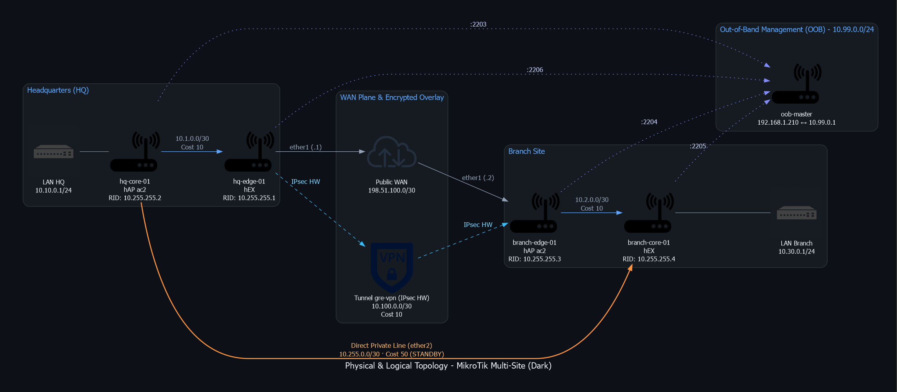
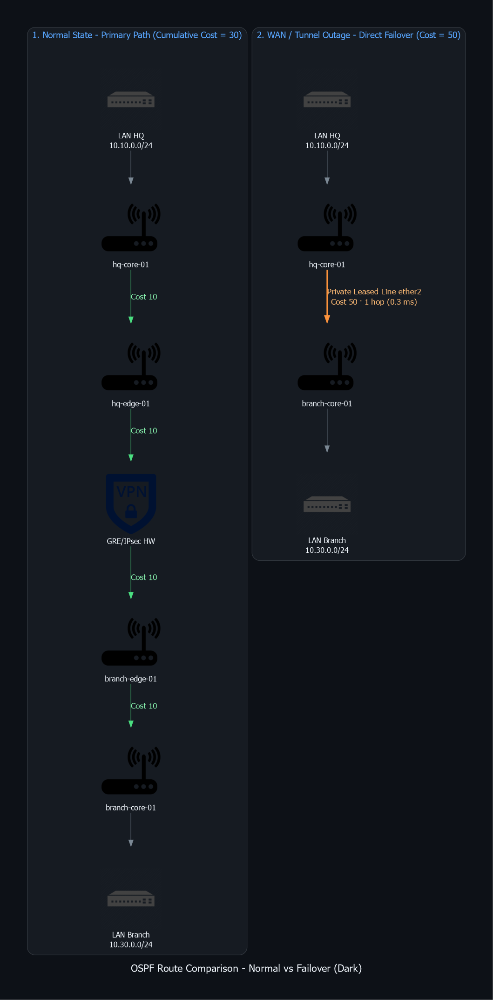
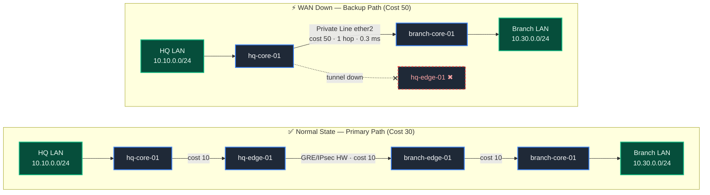

# Multi-Site MikroTik Lab: Redundant GRE/IPsec, OSPFv2 & Automated Telemetry

High-availability multi-site network infrastructure lab running on physical MikroTik hardware (hEX and hAP ac2). Implements a distributed architecture with a headquarters site (HQ) and a branch site (Branch), dynamic routing redundancy via OSPFv2, encrypted GRE over IPsec tunnels with hardware acceleration (SoC crypto engine), declarative automation with Ansible (organized workflow playbooks and modular role-based collection), and real-time packet telemetry streamed to Wireshark via TZSP with IPsec ESP encryption analysis.

---

## 1. Lab Topology

### 1.1 Physical & Logical Topology

<picture>
  <source media="(prefers-color-scheme: dark)" srcset="docs/img/network_topology_dark.png">
  <source media="(prefers-color-scheme: light)" srcset="docs/img/network_topology_light.png">
  
</picture>

<details>
<summary>View interactive Mermaid diagram</summary>


</details>

---

## 2. Addressing Plan & Inventory

| Node | Role | Hardware Model | Interface | IP Address | Function / Traffic |
| --- | --- | --- | --- | --- | --- |
| **hq-edge-01** | WAN Gateway HQ | hEX | `ether1`<br>`ether2`<br>`gre-vpn`<br>`ether5` | `198.51.100.1/30`<br>`10.1.0.1/30`<br>`10.100.0.1/30`<br>`10.99.0.6/24` | Public Direct WAN<br>Transit to HQ Core<br>GRE/IPsec Point-to-Point Tunnel<br>OOB Management (Port Forward 2206) |
| **hq-core-01** | Distribution / LAN | hAP ac2 | `ether1`<br>`ether2`<br>`br-lan`<br>`ether5` | `10.1.0.2/30`<br>`10.255.0.1/30`<br>`10.10.0.1/24`<br>`10.99.0.3/24` | Transit to HQ Edge<br>Backup Leased Line (Core-to-Core)<br>HQ Users Gateway (Passive OSPF)<br>OOB Management (Port Forward 2203) |
| **branch-edge-01** | WAN Gateway Branch | hAP ac2 | `ether1`<br>`ether2`<br>`gre-vpn`<br>`ether5` | `198.51.100.2/30`<br>`10.2.0.1/30`<br>`10.100.0.2/30`<br>`10.99.0.4/24` | Public Direct WAN<br>Transit to Branch Core<br>GRE/IPsec Point-to-Point Tunnel<br>OOB Management (Port Forward 2204) |
| **branch-core-01** | Distribution / LAN | hEX | `ether1`<br>`ether2`<br>`br-lan`<br>`ether5` | `10.2.0.2/30`<br>`10.255.0.2/30`<br>`10.30.0.1/24`<br>`10.99.0.5/24` | Transit to Branch Edge<br>Backup Leased Line (Core-to-Core)<br>Branch Users Gateway (Passive OSPF)<br>OOB Management (Port Forward 2205) |
| **oob-master** | Bastion OOB / NAT | RouterOS | `ether1`<br>`ether2-5` | `192.168.1.210/24`<br>`10.99.0.1/24` | Local LAN Uplink to Ansible Controller<br>Isolated Management Plane & TZSP NAT |

---

## 3. Routing Engineering & Redundancy (OSPFv2)

The control plane runs single-process OSPFv2 on backbone area `0.0.0.0` with optimizations for point-to-point topologies and deterministic path selection:

* **DR/BDR Suppression (`network-type=point-to-point`):** All transit interfaces and the tunnel operate without Designated Router elections, reducing Hello/LSU packet overhead and minimizing convergence time during topology changes.
* **User Interface Isolation (`passive=yes`):** The `br-lan` bridges advertise client subnets (`10.10.0.0/24` and `10.30.0.0/24`) as internal stub routes while preventing Hello transmission toward client segments.

### 3.1 Route Metrics & Failover Logic

<picture>
  <source media="(prefers-color-scheme: dark)" srcset="docs/img/ospf_failover_dark.png">
  <source media="(prefers-color-scheme: light)" srcset="docs/img/ospf_failover_light.png">
  
</picture>

<details>
<summary>View interactive Mermaid diagram</summary>



</details>

$$\text{Primary Path Cost (VPN)} = 10\ (\text{HQ Transit}) + 10\ (\text{GRE Tunnel}) + 10\ (\text{Branch Transit}) = \mathbf{30}$$

$$\text{Backup Path Cost (Direct Leased Line)} = \mathbf{50}$$

---

## 4. Repository Structure

The laboratory is structured into two complementary automation tiers: **Categorized workflow playbooks** and a **Modular role-based Ansible Collection**.

```text
.
├── collection/                          # Standard Ansible Collection (rsessa.routeros_ops)
│   ├── galaxy.yml                       # Official collection packaging manifest
│   ├── README.md                        # Technical documentation for roles and playbooks
│   ├── playbooks/                       # Role-based orchestrator playbooks
│   │   ├── deploy_site.yaml             # Complete router deployment
│   │   ├── setup_bastion.yaml           # Bastion provisioning & Firewall/NAT
│   │   ├── backup.yaml                  # Centralized backup extraction
│   │   ├── restore.yaml                 # Snapshot restoration
│   │   ├── upgrade.yaml                 # ROS & bootloader upgrade
│   │   └── audit.yaml                   # Resource & L2/L3 state audit
│   └── roles/                           # 9 Decoupled modular roles
│       ├── mikrotik_common/             # Identity, management services & authorized SSH keys
│       ├── mikrotik_interfaces/         # Bridges, member ports & physical interface states
│       ├── mikrotik_ip/                 # IP addressing & static routing tables
│       ├── mikrotik_gre_ipsec/          # GRE tunnels with accelerated IPsec encryption
│       ├── mikrotik_ospf/               # OSPFv2 instances, Router-ID, areas & networks
│       ├── mikrotik_firewall/           # Non-destructive Firewall Filter & NAT by comment
│       ├── mikrotik_backup/             # Plaintext (.rsc) & binary (.backup) extraction
│       ├── mikrotik_restore/            # Rollback & reboot verification
│       └── mikrotik_upgrade/            # Idempotent upgrade & bootloader alignment
│
├── playbooks/                           # Categorized lab workflow playbooks
│   ├── 01_provisioning/                 # Initial provisioning & network topology
│   │   ├── deploy_ssh_keys.yaml         # Authorized SSH public key injection
│   │   ├── setup_bastion_oob.yaml       # Hardening, DNAT & isolation of oob-master
│   │   └── deploy_topology.yaml         # Deployment of L2, L3, GRE/IPsec & OSPF
│   ├── 02_operations/                   # Maintenance & Day-2 operations
│   │   ├── backup_nodes.yaml            # Extraction of backups (.rsc and .backup)
│   │   ├── restore_nodes.yaml           # Unattended restore via :execute and polling
│   │   ├── upgrade_nodes.yaml           # Sequential RouterOS & firmware upgrades
│   │   └── discover_topology.yaml       # In-depth audit & configuration dump
│   └── 03_telemetry_security/           # Telemetry, TZSP streaming & IPsec research
│       ├── start_tzsp_streaming.yaml    # Starts traffic sniffing and TZSP streaming
│       ├── stop_tzsp_streaming.yaml     # Stops packet sniffing on lab routers
│       ├── enable_esp_null.yaml         # Switches IPsec proposal to NULL cipher (inspection)
│       └── revert_esp_secure.yaml       # Restores strong AES-256-CBC cipher with SHA-256
│
├── docs/                                # Interactive diagrams & graphic assets
├── generate_diagrams.py                 # Network diagram generator script
├── discover-inventory.sh                # MNDP neighbor discovery & inventory generator
└── README.md                            # Main project technical documentation
```

---

## 5. Playbook Execution Guide

All commands are executed from the repository root on the Ansible control node (WSL / Ubuntu):

### 5.1 Initial Provisioning (`playbooks/01_provisioning/`)

```bash
# 1. Deploy SSH keys across all nodes
ansible-playbook -i hosts.yaml playbooks/01_provisioning/deploy_ssh_keys.yaml

# 2. Configure and harden the OOB Bastion (oob-master)
ansible-playbook -i hosts.yaml playbooks/01_provisioning/setup_bastion_oob.yaml

# 3. Deploy full network topology (L2, L3, GRE/IPsec, and OSPF)
ansible-playbook -i hosts.yaml playbooks/01_provisioning/deploy_topology.yaml
```

### 5.2 Operations & Maintenance (`playbooks/02_operations/`)

```bash
# Backup extraction (.rsc and .backup)
ansible-playbook -i hosts.yaml playbooks/02_operations/backup_nodes.yaml

# Unattended restore of the latest available snapshot
ansible-playbook -i hosts.yaml playbooks/02_operations/restore_nodes.yaml

# Sequential upgrade of RouterOS and RouterBOARD bootloader
ansible-playbook -i hosts.yaml playbooks/02_operations/upgrade_nodes.yaml -e "target_version=7.18"

# Deep audit and telemetry data extraction
ansible-playbook -i hosts.yaml playbooks/02_operations/discover_topology.yaml
```

### 5.3 Telemetry & Security Analysis (`playbooks/03_telemetry_security/`)

```bash
# Start TZSP streaming toward Wireshark analysis station
ansible-playbook -i hosts.yaml playbooks/03_telemetry_security/start_tzsp_streaming.yaml -e "control_pc_ip=192.168.1.30"

# Switch IPsec proposal to ESP NULL to inspect internal GRE/OSPF packets in Wireshark
ansible-playbook -i hosts.yaml playbooks/03_telemetry_security/enable_esp_null.yaml

# Revert IPsec proposal to strong encryption (AES-256-CBC)
ansible-playbook -i hosts.yaml playbooks/03_telemetry_security/revert_esp_secure.yaml

# Stop TZSP streaming
ansible-playbook -i hosts.yaml playbooks/03_telemetry_security/stop_tzsp_streaming.yaml
```

---

## 6. Telemetry & Packet Analysis (TZSP & Wireshark)

To inspect control and data traffic in real time without physical packet capture interfaces on the routers, **TZSP** (*TaZmen Sniffer Protocol*, UDP/37008) is used.

### 6.1 Telemetry Routing and NAT

Traffic captured by lab routers toward the analysis host (`192.168.1.30`) traverses `oob-master` using symmetric masquerading to prevent dropped packets caused by asymmetric routing on the host:

```routeros
# On oob-master:
/ip firewall nat add chain=srcnat src-address=10.99.0.0/24 dst-address=192.168.1.0/24 action=masquerade comment="NAT-OOB-TO-PC"
```

### 6.2 Capture Modes & Security Inspection

* **Production Encrypted Traffic Inspection (ESP & ISAKMP):**
  When capturing on the WAN interface (`ether1`), GRE tunnel traffic travels encapsulated inside ESP (IP protocol 50).
  *Wireshark Filter:* `esp || isakmp`

* **Lab Payload Deep Inspection (ESP NULL):**
  To audit internal OSPF Hellos, LSUs, and ICMP headers without needing decryption keys in Wireshark, execute `playbooks/03_telemetry_security/enable_esp_null.yaml`. This switches the IPsec proposal to `enc-algorithms=null auth-algorithms=sha256` and flushes active SAs for immediate renegotiation.
  *Wireshark Filter:* `ospf || icmp || gre`

* **Restoration of Strong Encryption:**
  Once capture and analysis are complete, execute `playbooks/03_telemetry_security/revert_esp_secure.yaml` to reinstate `aes-256-cbc`.

---

## 7. Verification & Operational Results

### 7.1 Hardware Cryptographic Acceleration

Verification of active SAs offloaded to the SoC crypto engine:

```text
[admin@hq-edge-01] > /ip ipsec installed-sa print
Flags: H - hw-aead, A - AH, E - ESP
 #    SPI         STATE  SRC-ADDRESS    DST-ADDRESS    AUTH-ALGORITHM  ENC-ALGORITHM  ENC-KEY-SIZE
 0 HE 0x05173CDF  mature 198.51.100.2   198.51.100.1   sha1            aes-cbc        256
 1 HE 0x0222DAE8  mature 198.51.100.1   198.51.100.2   sha1            aes-cbc        256
```

### 7.2 OSPF Neighbor Adjacencies

```text
[admin@hq-edge-01] > /routing ospf neighbor print
 0 instance=default router-id=10.255.255.3 address=10.100.0.2 interface=gre-vpn priority=1 
   dr-address=0.0.0.0 backup-dr-address=0.0.0.0 state="Full"
 1 instance=default router-id=10.255.255.2 address=10.1.0.2 interface=ether2 priority=1 
   dr-address=0.0.0.0 backup-dr-address=0.0.0.0 state="Full"
```

### 7.3 End-to-End Traceroute

* **Normal State (Encrypted Tunnel - 3 hops):**
```text
[admin@hq-core-01] > /tool traceroute 10.30.0.1 src-address=10.10.0.1 use-dns=no count=3
 # ADDRESS        LOSS SENT  LAST   AVG  BEST WORST
 1 10.1.0.1         0%    3 0.4ms   0.4   0.3   0.5
 2 10.100.0.2       0%    3 0.8ms   0.8   0.7   0.9
 3 10.30.0.1        0%    3 0.9ms   0.9   0.8   1.0
```

* **Failover State WAN Down (Direct Leased Line - 1 hop):**
```text
[admin@hq-core-01] > /tool traceroute 10.30.0.1 src-address=10.10.0.1 use-dns=no count=3
 # ADDRESS        LOSS SENT  LAST   AVG  BEST WORST
 1 10.30.0.1        0%    3 0.3ms   0.3   0.3   0.3
```