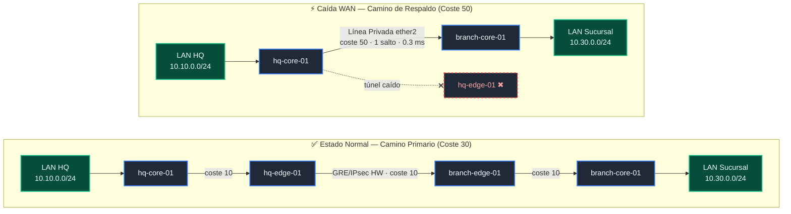

# Multi-Site MikroTik Lab: Redundant GRE/IPsec, OSPFv2 & Automated Telemetry

Laboratorio de infraestructura de red multisitio de alta disponibilidad sobre hardware físico MikroTik (hEX y hAP ac2). Implementa una arquitectura distribuida con sede central (HQ) y sucursal (Branch), redundancia dinámica enrutada mediante OSPFv2, túneles cifrados GRE over IPsec con aceleración por hardware (SoC crypto engine), automatización declarativa con Ansible y telemetría de paquetes en tiempo real mediante streaming TZSP hacia Wireshark.

---

## 1. Topología del Laboratorio

### 1.1 Topología Física y Lógica


---

## 2. Plan de Direccionamiento e Inventario

| Nodo | Rol | Modelo | Interfaz | Dirección IP | Función / Tráfico |
| --- | --- | --- | --- | --- | --- |
| **hq-edge-01** | WAN Gateway HQ | hEX | `ether1`<br>

<br>`ether2`<br>

<br>`gre-vpn`<br>

<br>`ether5` | `198.51.100.1/30`<br>

<br>`10.1.0.1/30`<br>

<br>`10.100.0.1/30`<br>

<br>`10.99.0.6/24` | WAN Pública Directa<br>

<br>Tránsito hacia HQ Core<br>

<br>Punto a Punto Túnel GRE/IPsec<br>

<br>Gestión OOB (Port Forward 2206) |
| **hq-core-01** | Distribución / LAN | hAP ac2 | `ether1`<br>

<br>`ether2`<br>

<br>`br-lan`<br>

<br>`ether5` | `10.1.0.2/30`<br>

<br>`10.255.0.1/30`<br>

<br>`10.10.0.1/24`<br>

<br>`10.99.0.3/24` | Tránsito hacia HQ Edge<br>

<br>Línea Privada Respaldo (Core-to-Core)<br>

<br>Gateway Usuarios HQ (OSPF Pasivo)<br>

<br>Gestión OOB (Port Forward 2203) |
| **branch-edge-01** | WAN Gateway Branch | hAP ac2 | `ether1`<br>

<br>`ether2`<br>

<br>`gre-vpn`<br>

<br>`ether5` | `198.51.100.2/30`<br>

<br>`10.2.0.1/30`<br>

<br>`10.100.0.2/30`<br>

<br>`10.99.0.4/24` | WAN Pública Directa<br>

<br>Tránsito hacia Branch Core<br>

<br>Punto a Punto Túnel GRE/IPsec<br>

<br>Gestión OOB (Port Forward 2204) |
| **branch-core-01** | Distribución / LAN | hEX | `ether1`<br>

<br>`ether2`<br>

<br>`br-lan`<br>

<br>`ether5` | `10.2.0.2/30`<br>

<br>`10.255.0.2/30`<br>

<br>`10.30.0.1/24`<br>

<br>`10.99.0.5/24` | Tránsito hacia Branch Edge<br>

<br>Línea Privada Respaldo (Core-to-Core)<br>

<br>Gateway Usuarios Branch (OSPF Pasivo)<br>

<br>Gestión OOB (Port Forward 2205) |
| **oob-master** | Bastión OOB / NAT | RouterOS | `ether1`<br>

<br>`ether2-5` | `192.168.1.210/24`<br>

<br>`10.99.0.1/24` | Uplink hacia LAN local y Ansible<br>

<br>Plano aislado de gestión y NAT TZSP |

---

## 3. Ingeniería de Enrutamiento y Redundancia (OSPFv2)

El plano de control corre OSPFv2 monoproceso en el área backbone `0.0.0.0` con optimizaciones para topologías punto a punto y selección determinista de rutas:

* **Supresión de DR/BDR (`network-type=point-to-point`):** Todas las interfaces de tránsito y el túnel operan sin elecciones Designated Router, reduciendo el overhead de paquetes Hello/LSU y minimizando el tiempo de convergencia ante cambios de estado.
* **Aislamiento de interfaces de usuario (`passive=yes`):** Los bridges `br-lan` anuncian las redes de clientes (`10.10.0.0/24` y `10.30.0.0/24`) como rutas stub internas, bloqueando la emisión de paquetes Hello hacia el exterior.

### 3.1 Métricas de Ruta y Lógica de Failover



$$\text{Coste Primario (VPN)} = 10\ (\text{Tránsito HQ}) + 10\ (\text{Túnel GRE}) + 10\ (\text{Tránsito Branch}) = \mathbf{30}$$

$$\text{Coste Respaldo (Línea Privada Directa)} = \mathbf{50}$$

---

## 4. Estructura del Repositorio y Automatización

```text
.
├── backups/                     # Snapshots binarios generados automáticamente
│   └── 20260903_123546/         # Snapshot de referencia base por nodo (.backup)
├── group_vars/
│   └── mikrotik_lab.yaml        # Variables globales de conexión RouterOS
├── hosts.yaml                   # Inventario con mapeo de puertos y bastión
├── deploy_topology.yaml         # Playbook de provisión integral (L2, L3, IPsec, OSPF)
├── restore_nodes.yaml           # Playbook de rollback desatendido con :execute
└── README.md                    # Documentación técnica del laboratorio

```

### 4.1 Despliegue de la Topología

Aplica de forma idempotente el saneamiento de interfaces, desvinculación de puertos de datos del bridge, configuración de túneles IPsec acelerados por hardware y activación de OSPF:

```bash
ansible-playbook -i hosts.yaml deploy_topology.yaml

```

### 4.2 Restauración Desatendida (`restore_nodes.yaml`)

En RouterOS, el comando interactivo `/system backup load` se cancela en sesiones SSH automatizadas (*Terminal is not prompting*). La restauración implementa la ejecución desacoplada en segundo plano con polling bidireccional de estados de socket:

```yaml
- name: Disparar restauración en segundo plano con :execute
  community.routeros.command:
    commands:
      - ':execute {/system backup load name="restore.backup" password=""}'

- name: Esperar a que el router corte la conexión (Reinicio físico en curso)
  ansible.builtin.wait_for:
    host: "{{ ansible_host }}"
    port: "{{ ansible_port }}"
    state: stopped
    delay: 3
    timeout: 30
  delegate_to: localhost

- name: Esperar a que el puerto SSH vuelva a responder
  ansible.builtin.wait_for:
    host: "{{ ansible_host }}"
    port: "{{ ansible_port }}"
    state: started
    delay: 15
    timeout: 120
  delegate_to: localhost

```

---

## 5. Telemetría y Análisis de Paquetes (TZSP & Wireshark)

Para inspeccionar el tráfico de control y datos en tiempo real sin requerir interfaces de captura en los routers, se emplea **TZSP** (*TaZmen Sniffer Protocol*, UDP/37008).

### 5.1 Enrutamiento y NAT de Telemetría

El tráfico capturado por `hq-edge-01` (`10.99.0.6`) hacia la estación de análisis (`192.168.1.30`) atraviesa `oob-master` mediante enmascaramiento dinámico para evitar descarte por enrutamiento asimétrico en el host:

```routeros
# En oob-master:
/ip firewall nat add chain=srcnat src-address=10.99.0.0/24 dst-address=192.168.1.0/24 action=masquerade comment="NAT-OOB-TO-PC"

```

### 5.2 Modos de Captura

* **Inspección de Tráfico en Claro (OSPF e ICMP en tránsito):**
```routeros
/tool sniffer set streaming-enabled=yes streaming-server=192.168.1.30 filter-interface=gre-vpn
/tool sniffer start

```


*Filtro Wireshark:* `ospf || icmp`
* **Inspección de Encapsulado WAN y Cifrado IPsec (ESP & ISAKMP):**
```routeros
/tool sniffer set streaming-enabled=yes streaming-server=192.168.1.30 filter-interface=ether1
/tool sniffer start

```


*Filtro Wireshark:* `esp || isakmp`

---

## 6. Verificación y Resultados Operativos

### 6.1 Aceleración Criptográfica Hardware

Confirmación de SA activas gestionadas por el motor criptográfico integrado (SoC crypto engine):

```text
[admin@hq-edge-01] > /ip ipsec installed-sa print
Flags: H - hw-aead, A - AH, E - ESP
 #    SPI         STATE  SRC-ADDRESS    DST-ADDRESS    AUTH-ALGORITHM  ENC-ALGORITHM  ENC-KEY-SIZE
 0 HE 0x05173CDF  mature 198.51.100.2   198.51.100.1   sha1            aes-cbc        256
 1 HE 0x0222DAE8  mature 198.51.100.1   198.51.100.2   sha1            aes-cbc        256

```

### 6.2 Adyacencias OSPF

```text
[admin@hq-edge-01] > /routing ospf neighbor print
 0 instance=default router-id=10.255.255.3 address=10.100.0.2 interface=gre-vpn priority=1 
   dr-address=0.0.0.0 backup-dr-address=0.0.0.0 state="Full"
 1 instance=default router-id=10.255.255.2 address=10.1.0.2 interface=ether2 priority=1 
   dr-address=0.0.0.0 backup-dr-address=0.0.0.0 state="Full"

```

### 6.3 Traza de Rutas Extremo a Extremo

* **Estado Normal (Túnel Cifrado - 3 saltos):**
```text
[admin@hq-core-01] > /tool traceroute 10.30.0.1 src-address=10.10.0.1 use-dns=no count=3
 # ADDRESS        LOSS SENT  LAST   AVG  BEST WORST
 1 10.1.0.1         0%    3 0.4ms   0.4   0.3   0.5
 2 10.100.0.2       0%    3 0.8ms   0.8   0.7   0.9
 3 10.30.0.1        0%    3 0.9ms   0.9   0.8   1.0

```


* **Estado Failover WAN Caída (Línea Privada Directa - 1 salto):**
```text
[admin@hq-core-01] > /tool traceroute 10.30.0.1 src-address=10.10.0.1 use-dns=no count=3
 # ADDRESS        LOSS SENT  LAST   AVG  BEST WORST
 1 10.30.0.1        0%    3 0.3ms   0.3   0.3   0.3

```