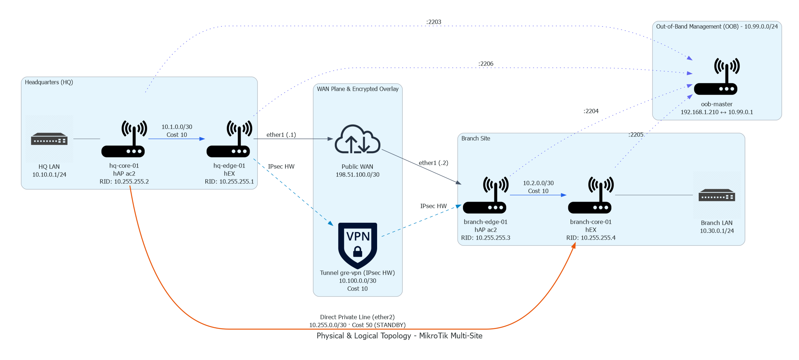
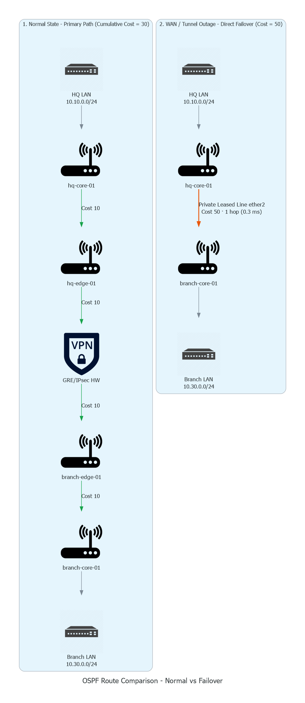

# Multi-Site MikroTik Lab: Redundant GRE/IPsec, OSPFv2 & Automated Telemetry

High-availability multi-site network infrastructure lab running on physical MikroTik hardware (hEX and hAP ac2). Implements a distributed architecture with a headquarters site (HQ) and a branch site (Branch), dynamic routing redundancy via OSPFv2, encrypted GRE over IPsec tunnels with hardware acceleration (SoC crypto engine), declarative automation with Ansible, and real-time packet telemetry streamed to Wireshark via TZSP.

---

## 1. Lab Topology

### 1.1 Physical & Logical Topology



<details>
<summary>View interactive Mermaid diagram</summary>


</details>

---

## 2. Addressing Plan and Inventory

| Node | Role | Model | Interface | IP Address | Function / Traffic |
| --- | --- | --- | --- | --- | --- |
| **hq-edge-01** | WAN Gateway HQ | hEX | `ether1`<br><br>`ether2`<br><br>`gre-vpn`<br><br>`ether5` | `198.51.100.1/30`<br><br>`10.1.0.1/30`<br><br>`10.100.0.1/30`<br><br>`10.99.0.6/24` | Direct Public WAN<br><br>Transit to HQ Core<br><br>GRE/IPsec Tunnel P2P<br><br>OOB Management (Port Forward 2206) |
| **hq-core-01** | Distribution / LAN | hAP ac2 | `ether1`<br><br>`ether2`<br><br>`br-lan`<br><br>`ether5` | `10.1.0.2/30`<br><br>`10.255.0.1/30`<br><br>`10.10.0.1/24`<br><br>`10.99.0.3/24` | Transit to HQ Edge<br><br>Backup Private Line (Core-to-Core)<br><br>HQ User Gateway (OSPF Passive)<br><br>OOB Management (Port Forward 2203) |
| **branch-edge-01** | WAN Gateway Branch | hAP ac2 | `ether1`<br><br>`ether2`<br><br>`gre-vpn`<br><br>`ether5` | `198.51.100.2/30`<br><br>`10.2.0.1/30`<br><br>`10.100.0.2/30`<br><br>`10.99.0.4/24` | Direct Public WAN<br><br>Transit to Branch Core<br><br>GRE/IPsec Tunnel P2P<br><br>OOB Management (Port Forward 2204) |
| **branch-core-01** | Distribution / LAN | hEX | `ether1`<br><br>`ether2`<br><br>`br-lan`<br><br>`ether5` | `10.2.0.2/30`<br><br>`10.255.0.2/30`<br><br>`10.30.0.1/24`<br><br>`10.99.0.5/24` | Transit to Branch Edge<br><br>Backup Private Line (Core-to-Core)<br><br>Branch User Gateway (OSPF Passive)<br><br>OOB Management (Port Forward 2205) |
| **oob-master** | OOB Bastion / NAT | RouterOS | `ether1`<br><br>`ether2-5` | `192.168.1.210/24`<br><br>`10.99.0.1/24` | Uplink to local LAN and Ansible<br><br>Isolated management plane and TZSP NAT |

---

## 3. Routing and Redundancy Engineering (OSPFv2)

The control plane runs single-process OSPFv2 in backbone area `0.0.0.0` with optimizations for point-to-point topologies and deterministic route selection:

* **DR/BDR suppression (`network-type=point-to-point`):** All transit interfaces and the tunnel operate without Designated Router elections, reducing Hello/LSU packet overhead and minimizing convergence time on state changes.
* **User interface isolation (`passive=yes`):** The `br-lan` bridges advertise client networks (`10.10.0.0/24` and `10.30.0.0/24`) as internal stub routes, blocking Hello packet emission to the outside.

### 3.1 Route Metrics and Failover Logic



<details>
<summary>View interactive Mermaid diagram</summary>


</details>

$$\text{Primary Cost (VPN)} = 10\ (\text{HQ Transit}) + 10\ (\text{GRE Tunnel}) + 10\ (\text{Branch Transit}) = \mathbf{30}$$

$$\text{Backup Cost (Direct Private Line)} = \mathbf{50}$$

---

## 4. Repository Structure and Automation

```text
.
├── backups/                     # Automatically generated binary snapshots
│   └── 20260903_123546/         # Base reference snapshot per node (.backup)
├── group_vars/
│   └── mikrotik_lab.yaml        # Global RouterOS connection variables
├── hosts.yaml                   # Inventory with port mapping and bastion
├── deploy_topology.yaml         # Full provisioning playbook (L2, L3, IPsec, OSPF)
├── restore_nodes.yaml           # Unattended rollback playbook using :execute
└── README.md                    # Lab technical documentation

```

### 4.1 Topology Deployment

Idempotently applies interface cleanup, data port bridge detachment, hardware-accelerated IPsec tunnel configuration, and OSPF activation:

```bash
ansible-playbook -i hosts.yaml deploy_topology.yaml

```

### 4.2 Unattended Restore (`restore_nodes.yaml`)

In RouterOS, the interactive command `/system backup load` is cancelled in automated SSH sessions (*Terminal is not prompting*). The restore playbook implements decoupled background execution with bidirectional socket state polling:

```yaml
- name: Trigger restore in background using :execute
  community.routeros.command:
    commands:
      - ':execute {/system backup load name="restore.backup" password=""}'

- name: Wait for the router to drop the connection (physical reboot in progress)
  ansible.builtin.wait_for:
    host: "{{ ansible_host }}"
    port: "{{ ansible_port }}"
    state: stopped
    delay: 3
    timeout: 30
  delegate_to: localhost

- name: Wait for the SSH port to respond again
  ansible.builtin.wait_for:
    host: "{{ ansible_host }}"
    port: "{{ ansible_port }}"
    state: started
    delay: 15
    timeout: 120
  delegate_to: localhost

```

---

## 5. Telemetry and Packet Analysis (TZSP & Wireshark)

To inspect control and data plane traffic in real time without requiring capture interfaces on the routers, **TZSP** (*TaZmen Sniffer Protocol*, UDP/37008) is used.

### 5.1 Telemetry Routing and NAT

Traffic captured by `hq-edge-01` (`10.99.0.6`) towards the analysis workstation (`192.168.1.30`) traverses `oob-master` via dynamic masquerading to avoid asymmetric routing drops on the host:

```routeros
# On oob-master:
/ip firewall nat add chain=srcnat src-address=10.99.0.0/24 dst-address=192.168.1.0/24 action=masquerade comment="NAT-OOB-TO-PC"

```

### 5.2 Capture Modes

* **Cleartext Traffic Inspection (OSPF and ICMP in transit):**
```routeros
/tool sniffer set streaming-enabled=yes streaming-server=192.168.1.30 filter-interface=gre-vpn
/tool sniffer start

```


*Wireshark filter:* `ospf || icmp`
* **WAN Encapsulation and IPsec Encryption Inspection (ESP & ISAKMP):**
```routeros
/tool sniffer set streaming-enabled=yes streaming-server=192.168.1.30 filter-interface=ether1
/tool sniffer start

```


*Wireshark filter:* `esp || isakmp`

---

## 6. Verification and Operational Results

### 6.1 Hardware Cryptographic Acceleration

Confirmation of active SAs managed by the integrated crypto engine (SoC crypto engine):

```text
[admin@hq-edge-01] > /ip ipsec installed-sa print
Flags: H - hw-aead, A - AH, E - ESP
 #    SPI         STATE  SRC-ADDRESS    DST-ADDRESS    AUTH-ALGORITHM  ENC-ALGORITHM  ENC-KEY-SIZE
 0 HE 0x05173CDF  mature 198.51.100.2   198.51.100.1   sha1            aes-cbc        256
 1 HE 0x0222DAE8  mature 198.51.100.1   198.51.100.2   sha1            aes-cbc        256

```

### 6.2 OSPF Adjacencies

```text
[admin@hq-edge-01] > /routing ospf neighbor print
 0 instance=default router-id=10.255.255.3 address=10.100.0.2 interface=gre-vpn priority=1 
   dr-address=0.0.0.0 backup-dr-address=0.0.0.0 state="Full"
 1 instance=default router-id=10.255.255.2 address=10.1.0.2 interface=ether2 priority=1 
   dr-address=0.0.0.0 backup-dr-address=0.0.0.0 state="Full"

```

### 6.3 End-to-End Traceroute

* **Normal State (Encrypted Tunnel - 3 hops):**
```text
[admin@hq-core-01] > /tool traceroute 10.30.0.1 src-address=10.10.0.1 use-dns=no count=3
 # ADDRESS        LOSS SENT  LAST   AVG  BEST WORST
 1 10.1.0.1         0%    3 0.4ms   0.4   0.3   0.5
 2 10.100.0.2       0%    3 0.8ms   0.8   0.7   0.9
 3 10.30.0.1        0%    3 0.9ms   0.9   0.8   1.0

```


* **WAN Failover State (Direct Private Line - 1 hop):**
```text
[admin@hq-core-01] > /tool traceroute 10.30.0.1 src-address=10.10.0.1 use-dns=no count=3
 # ADDRESS        LOSS SENT  LAST   AVG  BEST WORST
 1 10.30.0.1        0%    3 0.3ms   0.3   0.3   0.3

```